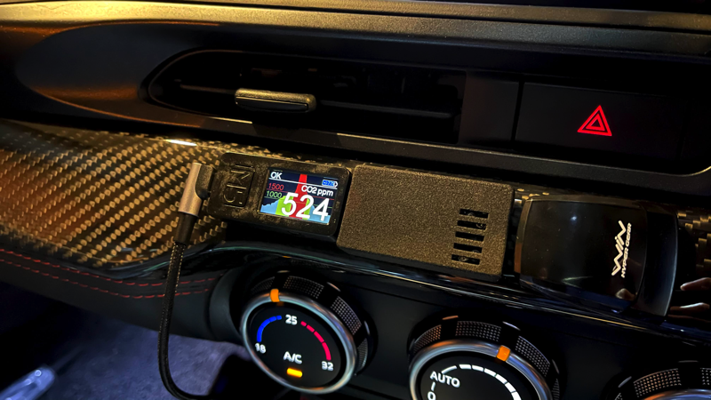
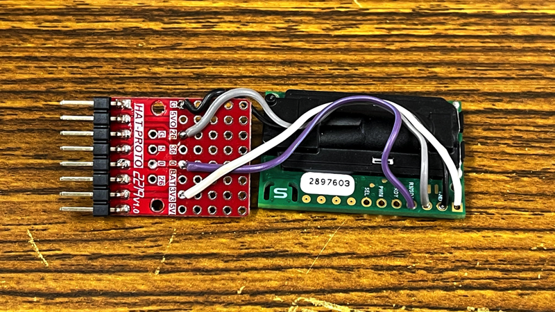
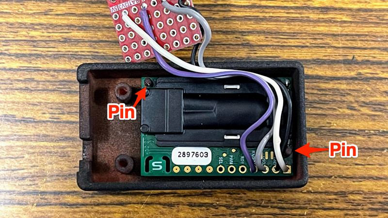
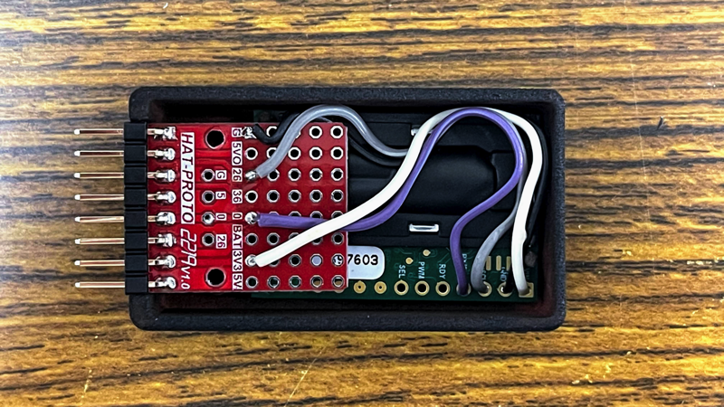

# M5StickCPlus_SCD30

## What's this

This is a CO2 concentration measuring system using M5StickCPlus and SCD30 with a time series graph function and a screen brightness switching function.

It also allows you to set the boundary values of warning/danger, which are set to 1000/1500 by default, and displays yellow when in warning and red when in danger.
The red LED will also blink slowly in the danger state.

As an added bonus, it also has the ability to display the charge status and battery level.

これは M5StickCPlus と SCD30 センサーを使った CO2 濃度グラフ表示器です。

時系列グラフ機能や、画面明るさ切り替え機能もついています。
また、warning / danger の境界値を設定することができ、デフォルトでは 1000 ppm/1500 ppm に設定されています。warning 状態では黄色、danger 状態では赤色の表示になります。

danger 状態のときには LED もゆっくりと点滅します。

おまけですが、充電状態とバッテリー残量の表示機能もあります。

## Overview

Button A: toggle brightness

Button B: toggle display

## How to build

### Buy

- SCD30
- M5StickC Proto Hat
- 3D printed case and lid
  - case https://make.dmm.com/item/1309572/
  - lid https://make.dmm.com/item/1309573/

### Connect

### set SCD30 in the case

### Close lid with Proto Hat's screws

